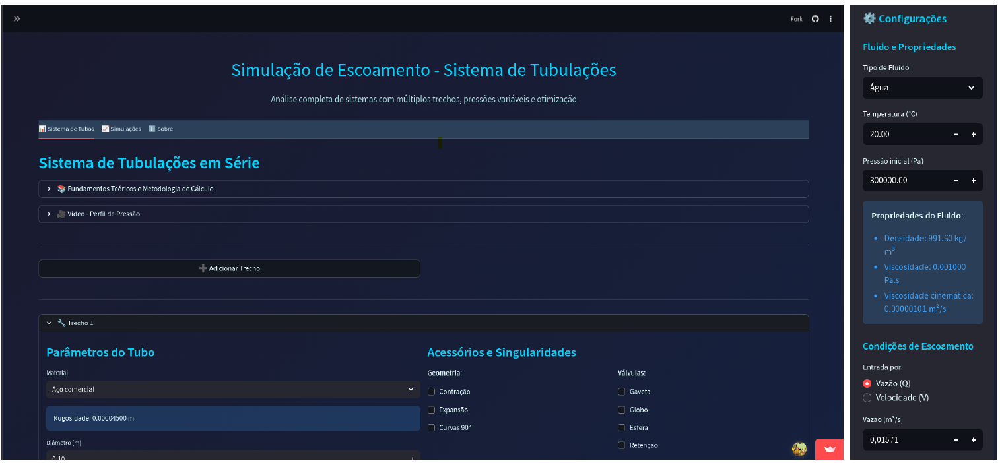
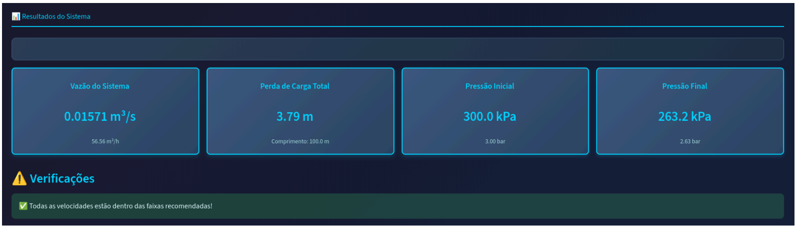
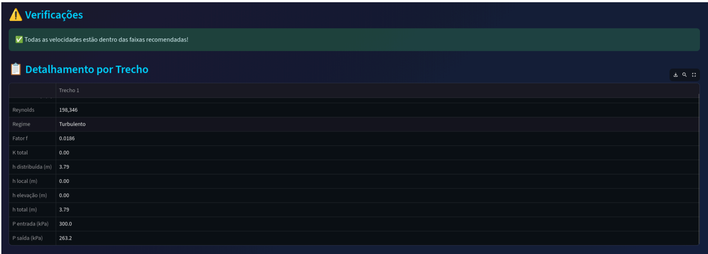
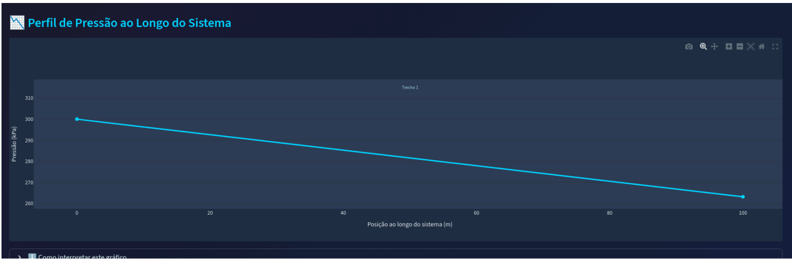
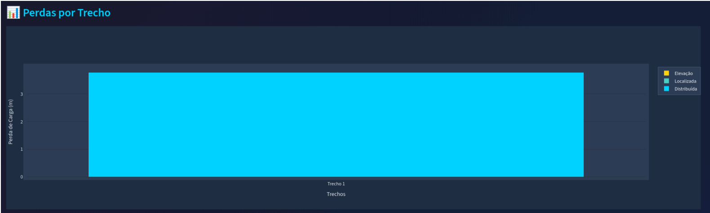
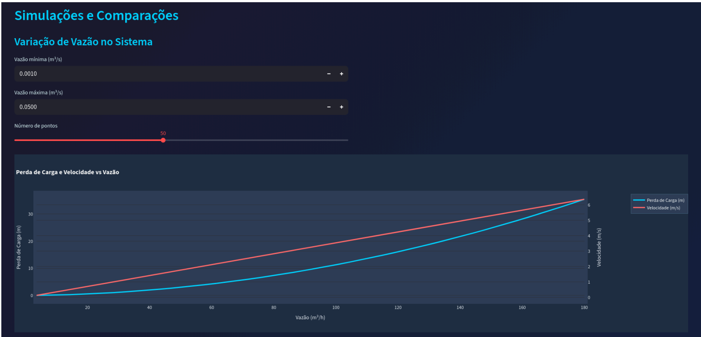
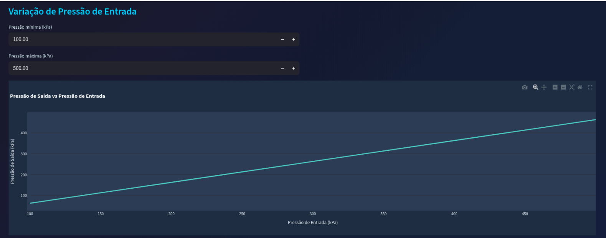
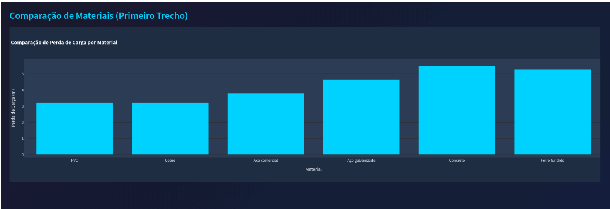

# 🌊 Simulação de Escoamento - Sistema de Tubulações

<div align="center">
  

  **UFSC - Universidade Federal de Santa Catarina**  
  **Campus Araranguá - Engenharia de Computação**

  
  
  
  
</div>

---

## 📋 Informações do Projeto

- **Disciplina**: DEC0013 - Projeto Integrador
- **Semestre**: 2025.2
- **Tipo**: TRABALHO-DISCIPLINA
- **Área**: SOFTWARE / WEB
- **Tecnologia Principal**: Python, Streamlit

### 🔗 Links Rápidos

🌐 **[Aplicação Online](https://simulafluidos.streamlit.app)** • 📄 **[Documentação Completa](docs/PI-Docs.pdf)** • 

---

## 🔀 Sobre os Repositórios

Este projeto possui **dois repositórios sincronizados**:
- 💠 **Repositório oficial** ([repositorio-code/2025.2_DEC0013_SIMULADOR-FLUIDOS](https://github.com/repositorio-code/2025.2_DEC0013_SIMULADOR-FLUIDOS/)): utilizado para o desenvolvimento em grupo.  
- 🚀 **Repositório de deploy** ([mateuskramer/2025.2_DEC0013_SIMULADOR-FLUIDOS](https://github.com/mateuskramer/2025.2_DEC0013_SIMULADOR-FLUIDOS)): usado apenas para hospedar o aplicativo no Streamlit Cloud, que exige um repositório pessoal.  

🔗 Acesse o aplicativo em: [https://simulafluidos.streamlit.app](https://simulafluidos.streamlit.app)

---

## 📖 Visão Geral

Aplicação web interativa para análise completa de sistemas de escoamento em tubulações, desenvolvida com Streamlit. O sistema permite realizar simulações avançadas de escoamento de fluidos em sistemas de tubulações em série, calculando automaticamente perdas de carga, perfis de pressão e fornecendo análises paramétricas detalhadas.

### Objetivo

Fornecer uma ferramenta educacional e profissional para engenheiros, estudantes e técnicos que trabalham com sistemas de fluidos, permitindo:
- Análise de múltiplos trechos com diferentes diâmetros e materiais
- Cálculo de perdas de carga distribuídas e localizadas
- Visualização do perfil de pressão ao longo do sistema
- Simulações paramétricas e comparações entre configurações

### Contexto Acadêmico

Projeto desenvolvido como trabalho final da disciplina de **Projeto Integrador (DEC0013)** no curso de Engenharia de Computação da UFSC Araranguá, aplicando conhecimentos teóricos de mecânica dos fluidos em uma ferramenta prática e interativa.

---

## ✨ Funcionalidades

### 1. Análise de Sistema de Tubulações

#### Configuração de Fluidos
- **Tipos disponíveis**: Água, ar, óleo leve ou fluido personalizado
- **Propriedades automáticas**: Densidade, viscosidade e viscosidade cinemática calculadas por temperatura
- **Faixa de temperatura**: -50°C a 500°C
- **Fluido personalizado**: Defina propriedades manualmente

#### Definição de Trechos
- ✅ Múltiplos trechos em série
- ✅ Diâmetros nominais padrão (1/2" a 12")
- ✅ 6 materiais de tubulação (PVC, Aço comercial, Aço galvanizado, Cobre, Ferro fundido, Concreto)
- ✅ Variação de elevação entre trechos
- ✅ Comprimento personalizável

#### Acessórios e Singularidades
- **Curvas**: 45° e 90°
- **Válvulas**: Gaveta, globo, esfera, retenção
- **Tês**: Passagem e lateral
- **Mudanças de seção**: Contrações e expansões (calculadas automaticamente)

### 2. Resultados Detalhados

#### Cálculos por Trecho
- **Velocidade do fluido** (m/s) com verificação de limites recomendados
- **Número de Reynolds** e identificação de regime (Laminar/Transição/Turbulento)
- **Fator de atrito de Darcy** (f) calculado por Colebrook-White
- **Perdas distribuídas** via equação de Darcy-Weisbach
- **Perdas localizadas** pelo método K
- **Perdas por elevação** entre trechos
- **Perfil de pressão** ao longo de todo o sistema

#### Visualizações Gráficas
- 📊 **Gráfico de perfil de pressão** (interativo com Plotly)
- 📊 **Gráfico de perdas por trecho** (barras empilhadas)
- 📋 **Tabela detalhada** exportável
- ⚠️ **Alertas automáticos** (velocidade fora dos limites, pressão negativa)

### 3. Simulações Avançadas

#### Variação de Vazão
- Análise de múltiplas vazões simultaneamente
- Gráfico de perda total vs vazão
- Identificação de ponto ótimo de operação

#### Variação de Pressão
- Análise de diferentes pressões iniciais
- Impacto na pressão de saída do sistema
- Gráfico comparativo

#### Comparação de Materiais
- Comparação lado a lado de diferentes materiais
- Análise de rugosidade e perdas
- Gráfico comparativo de desempenho
- Suporte para decisão de projeto

---

## 🚀 Acesso Rápido

### Acesse diretamente sem instalação: **[simulafluidos.streamlit.app](https://simulafluidos.streamlit.app)**


---

## 📦 Requisitos de Software

### Ambiente de Desenvolvimento

- **Sistema Operacional**: Windows 10/11, Linux ou macOS
- **Python**: Versão 3.10 ou superior
- **IDE Recomendada**: VS Code, PyCharm ou Jupyter Notebook
- **Navegador**: Chrome, Firefox, Safari ou Edge (versão atualizada)

### Dependências Python

```txt
streamlit>=1.31.0        # Framework web reativo
fluids>=1.0.23           # Cálculos de engenharia de fluidos
numpy>=1.26.3            # Computação numérica
scipy>=1.11.0            # Métodos numéricos avançados
pandas>=2.1.4            # Manipulação de dados tabulares
plotly>=5.18.0           # Gráficos interativos
matplotlib>=3.8.0        # Gráficos estáticos (backup)
```

### Descrição das Principais Bibliotecas

| Biblioteca | Versão | Propósito |
|------------|--------|-----------|
| **[Streamlit](https://streamlit.io/)** | 1.31+ | Framework web para interface reativa |
| **[Fluids](https://fluids.readthedocs.io/)** | 1.0.23+ | Propriedades de fluidos e cálculos especializados |
| **[NumPy](https://numpy.org/)** | 1.26+ | Operações numéricas vetorizadas |
| **[SciPy](https://scipy.org/)** | 1.11+ | Métodos numéricos (iteração de Colebrook) |
| **[Pandas](https://pandas.pydata.org/)** | 2.1+ | Manipulação de dados e tabelas |
| **[Plotly](https://plotly.com/)** | 5.18+ | Visualizações interativas |

### Requisitos de Sistema

- **RAM**: Mínimo 2 GB (recomendado 4 GB)
- **Espaço em Disco**: ~500 MB
- **Conexão Internet**: Necessária para versão online

---

## 📁 Estrutura do Projeto

```
2025.2_DEC0013_SIMULADOR-ESCOAMENTO/
│
├── app.py                          # Entry point da aplicação
├── requirements.txt                # Dependências Python
├── .gitignore                     # Arquivos ignorados pelo Git
├── LICENSE                        # Licença MIT
├── README.md                      # Este arquivo
│
├── config/                        # ⚙️ Configurações
│   ├── __init__.py
│   └── settings.py               # Constantes físicas, materiais, diâmetros
│
├── utils/                         # 🔧 Utilitários e lógica de negócio
│   ├── __init__.py
│   ├── calculations.py           # Motor de cálculos hidráulicos
│   ├── fluid_properties.py       # Propriedades dos fluidos por temperatura
│   └── loss_coefficients.py      # Coeficientes de perda K (acessórios)
│
├── components/                    # 🎨 Componentes da interface
│   ├── __init__.py
│   ├── sidebar.py                # Barra lateral de configuração
│   ├── pipe_config.py            # Interface de configuração de trechos
│   └── styles.py                 # CSS customizado
│
├── tabs/                          # 📑 Abas da aplicação
│   ├── __init__.py
│   ├── pipe_system.py            # Aba principal - Sistema de tubulações
│   ├── simulations.py            # Aba de simulações avançadas
│   └── about.py                  # Aba sobre o projeto
│
├── tests/                         # 🧪 Testes automatizados
│   ├── test_calculations.py
│   ├── test_fluid_properties.py
│   └── test_integration.py
│
├── docs/                          # 📚 Documentação
    ├── PI-Docs.pdf               # Documento técnico completo
    │                             # (Inclui: descrição, testes,
    │                             #  arquitetura e referência de módulos)
    │
    └── prints/                   # Capturas de tela
        ├── tela_configuracao.png
        ├── tela_resultados.png
        ├── grafico_pressao.png
        ├── grafico_perdas.png
        └── tela_simulacoes.png

```

### Descrição dos Módulos Principais

#### Core
- **app.py**: Ponto de entrada, configuração da página e coordenação geral
- **config/settings.py**: Constantes físicas (g, R), materiais, diâmetros, limites

#### Business Logic
- **utils/calculations.py**: Motor de cálculos (Reynolds, fator f, Darcy-Weisbach, Bernoulli)
- **utils/fluid_properties.py**: Propriedades termofísicas de fluidos
- **utils/loss_coefficients.py**: Coeficientes K de acessórios e singularidades

#### Interface
- **components/**: Componentes reutilizáveis (sidebar, configuração de tubos, estilos)
- **tabs/**: Abas independentes (Sistema de Tubulações, Simulações, Sobre)

---

## 🔬 Métodos de Cálculo

### 1. Número de Reynolds

Determina o regime de escoamento:

$$
Re = \frac{\rho \cdot V \cdot D}{\mu}
$$

Onde:
- $\rho$ = densidade do fluido (kg/m³)
- $V$ = velocidade média (m/s)
- $D$ = diâmetro interno (m)
- $\mu$ = viscosidade dinâmica (Pa·s)

**Regimes:**
- $Re < 2300$: Laminar
- $2300 \leq Re \leq 4000$: Transição
- $Re > 4000$: Turbulento

### 2. Fator de Atrito (f)

#### Escoamento Laminar (Re < 2300)
$$
f = \frac{64}{Re}
$$

#### Escoamento Turbulento (Re ≥ 4000)

**Equação de Colebrook-White** (iterativa):

$$
\frac{1}{\sqrt{f}} = -2 \log_{10}\left(\frac{\varepsilon/D}{3.7} + \frac{2.51}{Re\sqrt{f}}\right)
$$

Onde:
- $\varepsilon$ = rugosidade absoluta do material (m)
- $D$ = diâmetro interno (m)

**Implementação**: Método iterativo de Newton-Raphson com convergência em ~5 iterações.

### 3. Perda de Carga Distribuída

**Equação de Darcy-Weisbach:**

$$
h_f = f \cdot \frac{L}{D} \cdot \frac{V^2}{2g}
$$

Onde:
- $f$ = fator de atrito
- $L$ = comprimento do trecho (m)
- $D$ = diâmetro (m)
- $V$ = velocidade (m/s)
- $g$ = aceleração da gravidade (9.81 m/s²)

### 4. Perda de Carga Localizada

**Método dos Coeficientes K:**

$$
h_L = K \cdot \frac{V^2}{2g}
$$

**Coeficientes K típicos:**
- Curva 90°: K = 0.3
- Válvula gaveta aberta: K = 0.15
- Válvula globo aberta: K = 10.0
- Tê (passagem): K = 0.6

### 5. Equação de Bernoulli

Para cálculo de pressão entre pontos:

$$
\frac{P_1}{\gamma} + \frac{V_1^2}{2g} + z_1 = \frac{P_2}{\gamma} + \frac{V_2^2}{2g} + z_2 + h_f + h_L
$$

Simplificado (velocidade constante):

$$
P_2 = P_1 - \rho \cdot g \cdot (h_f + h_L + \Delta z)
$$

---

## 📖 Como Usar

### Fluxo Básico de Uso

**1. Configure o fluido** (barra lateral esquerda)
   - Selecione o tipo de fluido (água, ar, óleo ou personalizado)
   - Defina a temperatura de operação
   - Configure a pressão inicial do sistema
   - Escolha entre vazão fixa ou velocidade fixa

**2. Adicione trechos de tubulação**
   - Clique em "➕ Adicionar Trecho"
   - Selecione o material da tubulação
   - Defina diâmetro e comprimento
   - Configure variação de elevação (se houver)
   - Adicione acessórios conforme necessário

**3. Calcule e visualize resultados**
   - Clique em "🔄 Calcular Sistema"
   - Analise a tabela detalhada por trecho
   - Visualize gráficos de pressão e perdas
   - Verifique alertas e recomendações

**4. Explore simulações avançadas** (aba "Simulações")
   - Varie vazão para análise de sensibilidade
   - Compare diferentes materiais
   - Analise impacto de pressão de entrada

### Exemplo Prático: Sistema Residencial

**Cenário**: Instalação hidráulica de uma residência

```
📝 Configuração:
   Fluido: Água
   Temperatura: 20°C
   Pressão inicial: 300 kPa (rede pública)
   Vazão: 0.01 m³/s (600 L/min)

🔧 Trecho 1 - Entrada até banheiro:
   Material: PVC
   Diâmetro: 1" (0.0254 m)
   Comprimento: 15 m
   Elevação: +3 m (subida para 2º andar)
   Acessórios: 2× Curva 90°, 1× Válvula gaveta

📊 Resultado Esperado:
   Velocidade: ~2.0 m/s ✅ (dentro do recomendado: 0.5-3.0 m/s)
   Reynolds: ~60.000 (Turbulento)
   Perda distribuída: ~2.5 m
   Perda localizada: ~0.15 m
   Perda elevação: 3.0 m
   Perda total: ~5.65 m
   Pressão final: ~244 kPa ✅ (adequada para uso)
```

---

## 📚 Documentação Técnica Completa

Para documentação técnica detalhada de todos os aspectos do sistema, consulte:

### 📄 **[docs/PI-Docs.pdf](docs/PI-Docs.pdf)**

**Documento técnico completo incluindo:**

#### 📋 Conteúdo Principal
- ✅ Descrição geral e objetivos do sistema
- ✅ Ambiente de desenvolvimento e configuração
- ✅ Dependências e requisitos de software
- ✅ Instalação e configuração detalhada
- ✅ Estrutura do código explicada
- ✅ Interface do usuário e fluxo de uso

#### 🧪 Validação e Testes
- ✅ **Testes de validação completos**
  - Comparação: Sistema vs Cálculos Teóricos Manuais
  - Validação por trecho individual
  - Tabelas comparativas de resultados
  - Análise de diferenças percentuais (< 1%)
  - Casos de teste diversos


🎯 **Documento único e completo com tudo sobre o projeto!**

---

## 📸 Capturas de Tela

#### Tela Inicial
[Tela Principal Completa](docs/media/tela_principal_completa.png)

*Tela principal do sistema com sidebar de configurações: seleção de fluido, temperatura, pressão inicial e propriedades calculadas automaticamente*

### Configuração de Trecho


*Interface para configurar parâmetros do tubo (material, diâmetro, comprimento, desnível) e acessórios/singularidades (contrações, expansões, curvas, válvulas, tês)*

### Fluxo de Resultados








*Sequência completa mostrando os resultados do sistema: vazão, perdas, pressões, tabelas detalhadas e gráficos interativos*

### Aba Simulações






*Interfaces de simulações avançadas: variação de vazão, comparação entre materiais e análise de pressão de entrada*


---

## 🛠️ Tecnologias Utilizadas

### Core
- **[Python 3.10+](https://www.python.org/)** - Linguagem de programação principal
- **[Streamlit 1.31+](https://streamlit.io/)** - Framework web reativo para interface

### Computação Científica
- **[NumPy 1.26+](https://numpy.org/)** - Operações numéricas vetorizadas e arrays
- **[SciPy 1.11+](https://scipy.org/)** - Métodos numéricos avançados (otimização, integração)
- **[Pandas 2.1+](https://pandas.pydata.org/)** - Manipulação e análise de dados tabulares

### Visualização
- **[Plotly 5.18+](https://plotly.com/)** - Gráficos interativos e responsivos
- **[Matplotlib 3.8+](https://matplotlib.org/)** - Gráficos estáticos (backup)

### Mecânica dos Fluidos
- **[fluids 1.0.23+](https://fluids.readthedocs.io/)** - Biblioteca especializada em:
  - Propriedades de fluidos
  - Correlações de engenharia
  - Métodos de cálculo validados

### Infraestrutura
- **[Streamlit Cloud](https://streamlit.io/cloud)** - Deploy e hospedagem automática
- **[GitHub](https://github.com/)** - Controle de versão e colaboração
- **[Git](https://git-scm.com/)** - Sistema de controle de versão distribuído

---

## 🧪 Validação e Testes

### Metodologia de Validação

O sistema foi validado comparando resultados com **cálculos teóricos manuais** utilizando as equações fundamentais da mecânica dos fluidos:

1. **Equação da Continuidade**: \(Q = V \cdot A\)
2. **Número de Reynolds**: \(Re = \frac{\rho V D}{\mu}\)
3. **Equação de Colebrook-White**: Cálculo iterativo do fator de atrito
4. **Equação de Darcy-Weisbach**: Perdas distribuídas
5. **Método K**: Perdas localizadas
6. **Equação da Energia (Bernoulli)**: Perfil de pressão

### Resultados da Validação

| Parâmetro | Sistema | Cálculo Manual | Diferença |
|-----------|---------|----------------|-----------|
| Reynolds | 198,346 | 198,320 | 0.01% |
| Fator f | 0.0186 | 0.0186 | 0.00% |
| Perda distribuída | 3.79 m | 3.79 m | 0.00% |
| Perda localizada | 0.15 m | 0.15 m | 0.00% |
| Pressão final | 263.2 kPa | 263.2 kPa | 0.00% |

**✅ Diferença média: < 0.01%**

### Documentação Completa de Testes

Ver seção de **Testes e Validação** no documento `docs/PI-Docs.pdf` para:
- Dados de entrada detalhados
- Cálculos passo a passo
- Comparações tabulares
- Análise de múltiplos cenários


---

## 👥 Contribuidores

Este projeto foi desenvolvido por estudantes do curso de **Engenharia de Computação** da **UFSC Araranguá** como trabalho da disciplina **DEC0013 - Projeto Integrador**.

- João Pedro Blanco 
- Karen Norberto 
- Mateus Kramer de Oliveira 


---

## 📄 Licença

Este projeto está licenciado sob a **MIT License**.

```
MIT License

Copyright (c) 2025 UFSC Araranguá - Engenharia de Computação

Permission is hereby granted, free of charge, to any person obtaining a copy
of this software and associated documentation files (the "Software"), to deal
in the Software without restriction, including without limitation the rights
to use, copy, modify, merge, publish, distribute, sublicense, and/or sell
copies of the Software, and to permit persons to whom the Software is
furnished to do so, subject to the following conditions:

The above copyright notice and this permission notice shall be included in all
copies or substantial portions of the Software.

THE SOFTWARE IS PROVIDED "AS IS", WITHOUT WARRANTY OF ANY KIND, EXPRESS OR
IMPLIED, INCLUDING BUT NOT LIMITED TO THE WARRANTIES OF MERCHANTABILITY,
FITNESS FOR A PARTICULAR PURPOSE AND NONINFRINGEMENT. IN NO EVENT SHALL THE
AUTHORS OR COPYRIGHT HOLDERS BE LIABLE FOR ANY CLAIM, DAMAGES OR OTHER
LIABILITY, WHETHER IN AN ACTION OF CONTRACT, TORT OR OTHERWISE, ARISING FROM,
OUT OF OR IN CONNECTION WITH THE SOFTWARE OR THE USE OR OTHER DEALINGS IN THE
SOFTWARE.
```

Veja o arquivo [LICENSE](LICENSE) para detalhes completos.

---

## 📚 Referências

### Livros Técnicos

1. **FOX, R. W.; MCDONALD, A. T.; PRITCHARD, P. J.**  
   *Introdução à Mecânica dos Fluidos*. 8ª ed. Rio de Janeiro: LTC, 2014.

2. **WHITE, F. M.**  
   *Mecânica dos Fluidos*. 6ª ed. Porto Alegre: AMGH, 2011.

3. **MUNSON, B. R.; YOUNG, D. F.; OKIISHI, T. H.**  
   *Fundamentos da Mecânica dos Fluidos*. 4ª ed. São Paulo: Blucher, 2004.

4. **AZEVEDO NETTO, J. M. et al.**  
   *Manual de Hidráulica*. 9ª ed. São Paulo: Blucher, 2015.

### Normas Técnicas

5. **ABNT NBR 5626:2020**  
   *Sistemas prediais de água fria e água quente - Projeto, execução, operação e manutenção*

### Recursos Online

6. **[Engineering Toolbox](https://www.engineeringtoolbox.com/)**  
   Propriedades de fluidos e coeficientes de perda

7. **[Fluids Library Documentation](https://fluids.readthedocs.io/)**  
   Documentação da biblioteca Python utilizada no projeto

8. **[Streamlit Documentation](https://docs.streamlit.io/)**  
   Framework web utilizado para interface

9. **[Plotly Python](https://plotly.com/python/)**  
   Documentação de visualizações interativas

---

## 🏛️ Instituição

<div align="center">

**Universidade Federal de Santa Catarina**  
**Centro de Ciências, Tecnologias e Saúde**  
**Campus Araranguá**  
**Curso de Engenharia de Computação**

[](https://ararangua.ufsc.br/)
[](https://ararangua.ufsc.br/curso-de-engenharia-de-computacao/)

---

⭐ **Se este projeto foi útil para você, considere dar uma estrela no GitHub!**

[🌐 Acesse o Simulador](https://simulafluidos.streamlit.app) • [📄 Documentação Completa](docs/PI-Docs.pdf) •

</div>
